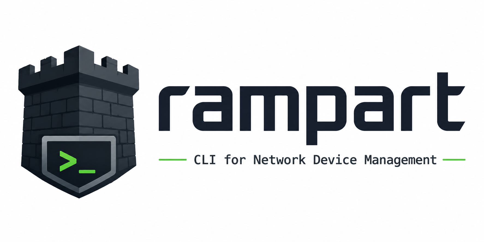

<p align="center">
  
</p>

<h1 align="center">rampart</h1>

`rampart` is a CLI for managing a **local UniFi gateway or controller**: firewall
rules, zone-based firewall policies, devices, clients and firewall groups —
designed to be pleasant interactively *and* trivially parseable from scripts.

- Works with UniFi OS gateways (UDM / UDR / UCG / UX...) and legacy software
  controllers (`:8443`) — the flavor is auto-detected.
- Auth via local **API key** (recommended) or username/password.
- `--json` on every command for scripting (raw controller objects, jq-friendly).
- Plain tab-aligned tables by default (awk/cut friendly).
- `-i` for an interactive Bubble Tea TUI — space toggles rules on/off in place.
- Shell autocompletion, including **live completion of rule/policy IDs** pulled
  from your gateway.

## Install

```sh
go install github.com/mr0xb/rampart@latest
```

Or from source:

```sh
git clone https://github.com/mr0xb/rampart
cd rampart
go build -o rampart .
sudo install rampart /usr/local/bin/
```

Or grab a prebuilt binary from [releases](https://github.com/mr0xb/rampart/releases):

```sh
curl -sSLo rampart.gz \
  https://github.com/mr0xb/rampart/releases/latest/download/rampart_<version>_linux_amd64.gz
gunzip rampart.gz && chmod +x rampart
sudo install rampart /usr/local/bin/
```

## Configure

Create an API key in the UniFi UI: **Settings → Control Plane → Integrations →
Create API Key**, then either export environment variables:

```sh
export RAMPART_HOST=192.168.1.1
export RAMPART_API_KEY=xxxxxxxxxxxx
```

or create `~/.config/rampart/config.json`:

```json
{
  "host": "192.168.1.1",
  "api_key": "xxxxxxxxxxxx",
  "site": "default"
}
```

Username/password auth also works (`--user/--pass`, `RAMPART_USER`/`RAMPART_PASS`,
or `"user"`/`"pass"` in the config file). Precedence is **flags > env > file**.

> **TLS note:** UniFi gear ships self-signed certificates, so certificate
> verification is **skipped by default**. If you've installed a proper cert,
> turn verification back on with `--insecure=false` (or `"insecure": false` in
> the config file).

For a legacy software controller use `--legacy --host https://controller:8443`.

## Usage

### Firewall rules (classic, pre-9.x ruleset model)

```sh
rampart fw list                          # all rules
rampart fw list --ruleset WAN_IN         # one ruleset
rampart fw list -i                       # TUI: ↑/↓ navigate, space = enable/disable, q = quit

rampart fw add --name "Block telnet" --ruleset LAN_IN --action drop \
    --protocol tcp --dst-port 23         # index auto-assigned (next free >= 2000)

rampart fw set <rule-id> --dst-port 2222 --log   # only passed flags change
rampart fw enable <rule-id>...
rampart fw disable <rule-id>...
rampart fw delete <rule-id>...
rampart fw get <rule-id>                 # full JSON of one rule
```

### Firewall policies (zone-based, UniFi Network 9+)

If your gateway migrated to the zone-based firewall, classic rules will be
empty — use `policy` instead:

```sh
rampart policy list                      # user policies (add --all for predefined)
rampart policy list -i                   # TUI with space-to-toggle
rampart policy enable|disable|delete <policy-id>...
rampart policy get <policy-id>           # full JSON

# The policy schema is rich; author new ones by editing an existing one:
rampart policy get <id> | jq 'del(._id) | .name = "My copy"' | rampart policy add -f -
```

### Devices, clients, groups

```sh
rampart devices            # gateways, switches, APs (state, version, uptime)
rampart clients            # connected stations (alias: sta)
rampart groups             # firewall address/port groups
```

### Scripting with --json

`--json` emits the raw controller objects (all fields, not just the displayed
columns):

```sh
# IDs of all disabled WAN_IN rules
rampart fw list --ruleset WAN_IN --json | jq -r '.[] | select(.enabled|not) | ._id'

# Disable every rule whose name starts with "Temp"
rampart fw list --json | jq -r '.[] | select(.name|startswith("Temp")) | ._id' \
    | xargs rampart fw disable

# All wireless client IPs
rampart clients --json | jq -r '.[] | select(.is_wired|not) | .ip'
```

The default table output is tab-aligned plain text, so `awk '{print $1}'` and
friends work too.

## Autocompletion

```sh
# zsh
rampart completion zsh > "${fpath[1]}/_rampart"

# bash
rampart completion bash > /etc/bash_completion.d/rampart

# fish
rampart completion fish > ~/.config/fish/completions/rampart.fish
```

Completion is live: `rampart fw disable <TAB>` queries the gateway and offers
rule IDs annotated with rule names.

## Development

`hack/mock_unifi.py` is a stdlib-only mock of the UniFi API used to smoke-test
without touching real gear:

```sh
python3 hack/mock_unifi.py &
RAMPART_HOST=http://127.0.0.1:8765 RAMPART_USER=admin RAMPART_PASS=pw ./rampart fw list
```

## Notes & caveats

- The zone endpoint of the v2 API varies across firmware versions; rampart
  tries the known variants and falls back to showing raw zone IDs in
  `policy list` if none respond.
- `fw set`/`fw enable`/`fw disable` fetch the full rule and round-trip every
  field, so settings rampart doesn't know about are preserved.
- Deletes are immediate and unconfirmed (it's a scripting tool) — `fw list`
  before you `fw delete`.
